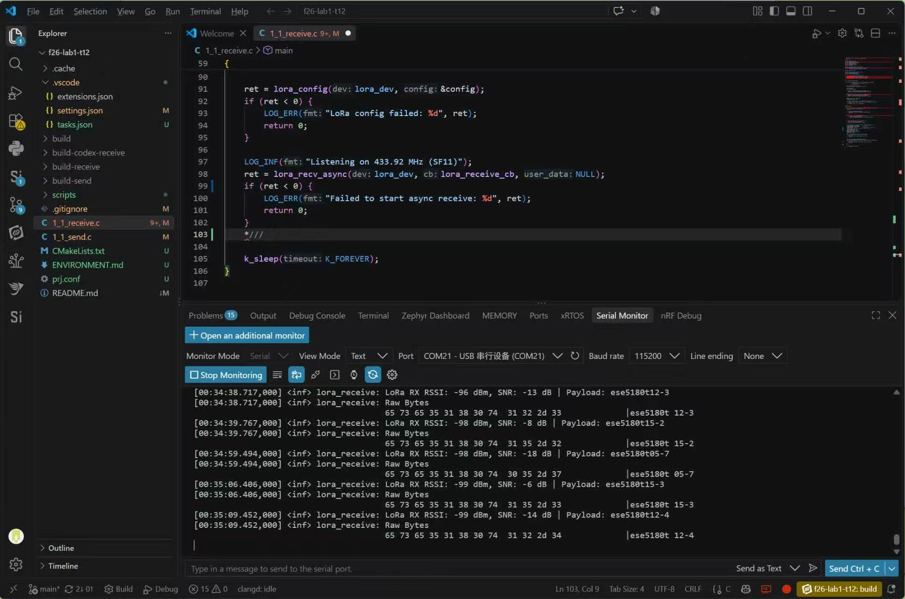
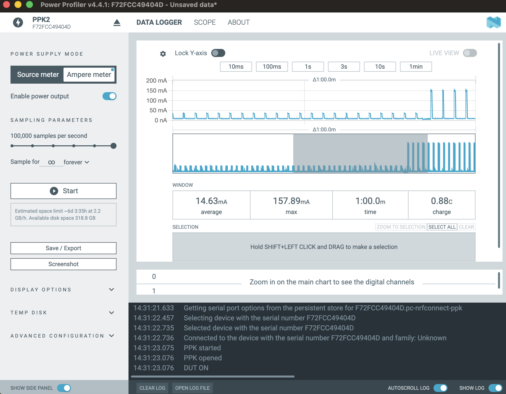
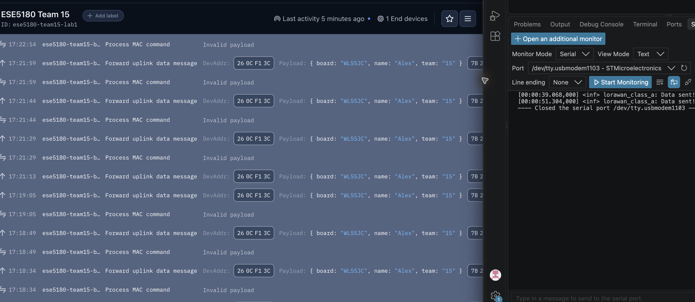

# ESE5180 Lab 1: Wireless Communications

**Team 15:** Lei, Si Wei (`laialex@engineering.upenn.edu`) and Yu, Alexander
(`ayu2126@engineering.upenn.edu`)

## 1.1 LoRa Range Challenge

Files: `1_1_lora_range/1_1_send.c` and `1_1_receive.c`

Payload: `ese5180t15-N`

| Result | Value |
|---|---:|
| Longest successful distance | **478 m** |
| RSSI at longest distance | **-99 dBm** |
| SNR at longest distance | **-6 dB** |



| Parameter | Value |
|---|---:|
| Frequency | 433.92 MHz |
| TX power | -10 dBm |
| Bandwidth | 125 kHz |
| Spreading factor | SF11 |
| Coding rate | 4/8 |
| Preamble | 16 symbols |

**Why is this the case? Check out the firmware source—if you wanted to avoid
interference from other student LoRa boards, what might you do?**

Raw LoRa has no device identity at the physical layer, so a receiver accepts
packets with matching radio settings. Our receiver checks the
`ese5180t15-` prefix and counter and ignores packets from other teams.

**What firmware and hardware configurations helped increase the successful
transmission range?**

SF11, BW125, CR4/8, a 16-symbol preamble, line of sight, correct antenna
orientation, and keeping the antenna away from metal improved range.

**What are some disadvantages you've noted when maximizing distance this way?**

The configuration has a low data rate, long airtime, higher energy per packet,
and more channel occupancy.

**What configurations are realistic in a real-world product?**

A product should use the shortest airtime and lowest transmit power that still
provide the required range and link margin, while obeying regional radio rules.

## 1.2 Trading Range for Bandwidth

Files: `1_2_lora_bandwidth/1_2_send.c` and `1_2_receive.c`

| Parameter | 1.1 range | 1.2 bandwidth |
|---|---:|---:|
| Bandwidth | 125 kHz | **500 kHz** |
| Spreading factor | SF11 | **SF5** |
| Coding rate | 4/8 | **4/5** |
| Preamble | 16 | **12** |
| 12-byte airtime | 857 ms | **4 ms** |
| Nominal coded bit rate | 0.336 kbps | **62.5 kbps** |

The fastest measured packet airtime was **4 ms**. Frequency remained
433.92 MHz and TX power remained -10 dBm. Increasing bandwidth to 500 kHz,
reducing the spreading factor to SF5, using CR4/5, and using the minimum valid
12-symbol SF5 preamble produced this result. Consecutive Team 15 packets were
received:

```text
RX RSSI: -54 dBm | SNR: 9 dB | Payload: ese5180t15-1
RX RSSI: -52 dBm | SNR: 9 dB | Payload: ese5180t15-2
```

**What is the “Spreading Factor”? What transmission quantities does the
spreading factor affect? What is the tradeoff?**

The spreading factor determines the number of chirps per symbol (`2^SF`). A
higher SF increases symbol duration, receiver sensitivity, range,
airtime, and packet energy while reducing data rate. A lower SF increases data
rate and reduces airtime and energy, but reduces sensitivity and range.

**What kinds of applications would suit the low-bandwidth option? Name at
least two. Why would the tradeoff be worth it?**

Environmental or agricultural sensors, utility meters, and remote asset
trackers suit the low-bandwidth option. They send small, infrequent messages,
so longer range and battery life are more valuable than high throughput.

## 1.3 Energy Check

Files: `1_3_energy/`

Both profiles used 915 MHz, BW125, SF10, CR4/5, an 8-symbol preamble, a
12-byte payload, and a 2-second interval. Only TX power changed.

| Profile | TX power | Peak TX current |
|---|---:|---:|
| Lowest | -9 dBm | **39.20 mA** |
| Highest | +22 dBm | **157.89 mA** |



**Beyond just transmit power, what else will affect the current draw and
battery life of a LoRa device? Could a coin cell battery power the largest Tx
current draw measured? AA batteries? LiPo?**

Airtime, message frequency, retries, receive windows, MCU sleep current,
peripherals, regulator efficiency, and battery self-discharge affect battery
life. A coin cell is generally unsuitable for the measured 157.89 mA pulse
because its internal resistance can cause excessive voltage sag. AA cells or a
suitable LiPo can supply the pulse if their datasheet current limits are met.

## 2. LoRaWAN

### 2.1 Modified LoRaWAN code

Files: `2_lorawan/src/main.c`, `2_lorawan/prj.conf`, and
`2_lorawan/uplink_decoder.js`

```json
{"name":"Alex","team":"15","board":"WL55JC"}
```

### 2.2 Latest decoded payload, live data, and serial monitor



**What is the difference between the `LORAWAN_MSG_UNCONFIRMED` and
`LORAWAN_MSG_CONFIRMED` parameters in the `lorawan_send` API? What use cases
can you think of for tuning these parameters?**

`LORAWAN_MSG_CONFIRMED` requests a network acknowledgement and may retry if no
acknowledgement arrives. It is appropriate for alarms or critical state
changes. `LORAWAN_MSG_UNCONFIRMED` does not request an acknowledgement; it is
better for frequent, replaceable telemetry because it uses less airtime and
energy.

**Why do we need to hit RESET session and MAC state on the TTN console?**

An ABP device and TTN must agree on frame counters and MAC state. Reflashing
can reset the device's counters while TTN retains the old values, causing TTN
to reject new packets as replays. Resetting the session and MAC state
resynchronizes them for this lab device.

**Why does LoRaWAN require device identifiers (DevEUI, DevAddr) and session
keys (NwkSKey, AppSKey), while raw LoRa communication does not? What problem
does this solve in large-scale networks?**

Raw LoRa only sends radio packets and does not define identity, routing,
authentication, or encryption. LoRaWAN uses DevEUI and DevAddr to identify and
route devices, NwkSKey to authenticate network traffic, and AppSKey to protect
application data. This lets many devices securely share gateway and network
infrastructure without accepting or exposing one another's traffic.

**In this assignment, we used ABP for simplicity. Explain one advantage of
OTAA in real deployments, and why it is preferred over ABP outside classroom
prototypes.**

OTAA performs a join procedure and derives fresh session keys instead of
permanently installing fixed session credentials. This makes provisioning,
key renewal, device replacement, and network migration safer and easier, so it
is preferred for real deployments.
